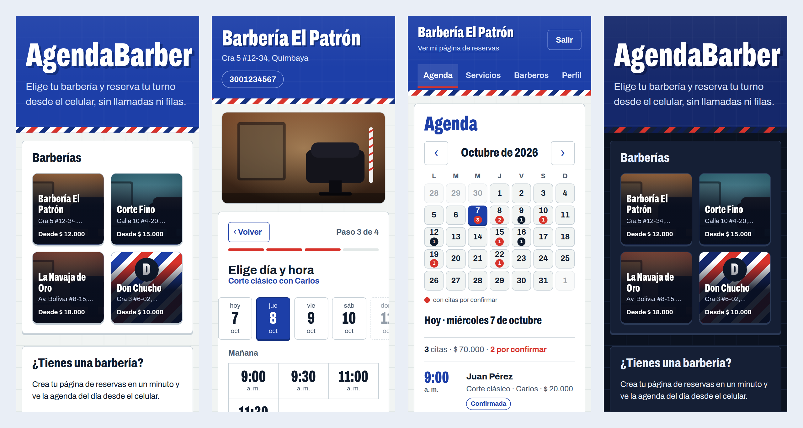
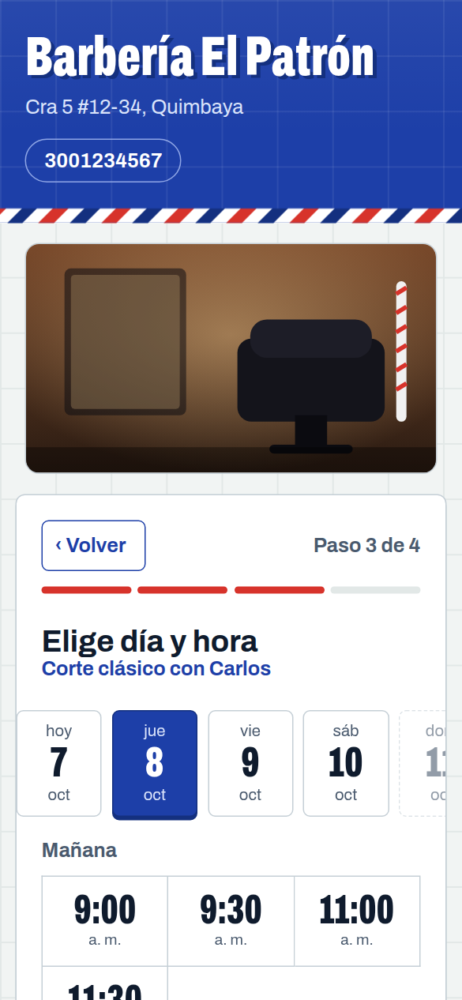
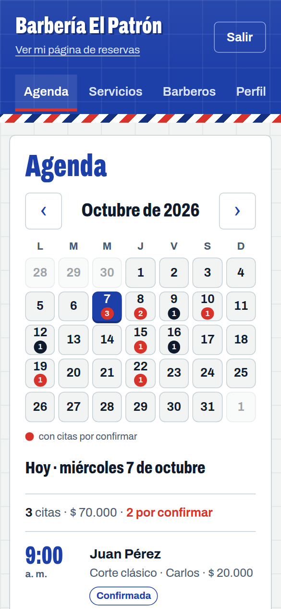
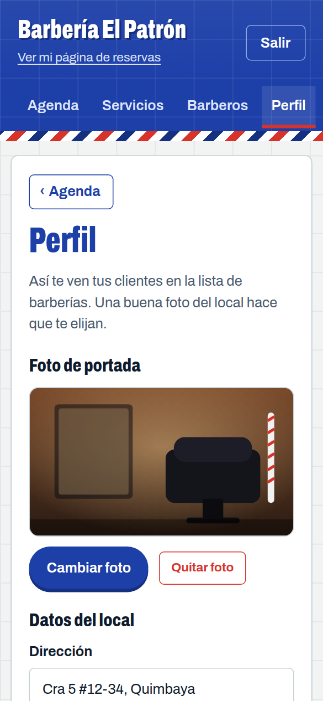
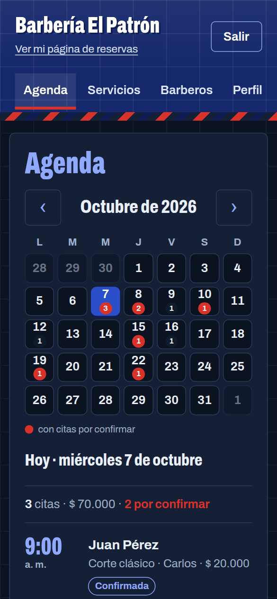
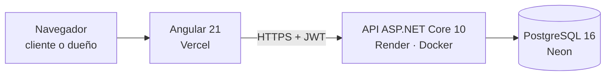

# AgendaBarber

Reservas en línea para barberías: el cliente elige su turno desde el celular, sin crear cuenta y sin llamar; el dueño ve su agenda en un calendario y administra servicios, barberos, horarios y el perfil de su local.

**Demo en línea:** https://agenda-barber-liard.vercel.app
La API corre en un plan gratuito que se duerme tras 15 minutos sin uso: la primera carga puede tardar hasta un minuto.



*Capturas con datos de demostración.*

**Stack:** .NET 10 (ASP.NET Core, EF Core) · PostgreSQL 16 · Angular 21 · JWT · Docker

## Qué puede hacer

**El cliente** (sin cuenta):
- Ve la lista de barberías con foto, dirección y precio desde.
- Reserva en 4 pasos con botón **Volver**: servicio, barbero, día y hora, datos.
- Recibe un tiquete con su turno. Si alguien tomó esa hora antes, se le avisa y elige otra.

**El dueño** (con cuenta):
- Crea su barbería y obtiene su enlace y un código QR para pegar en el local.
- Agenda en **calendario mensual**: cada día muestra cuántas citas tiene y en rojo las que faltan por confirmar. Al tocar un día ve sus citas y puede confirmar, cancelar, marcar atendida o no asistió, y mandar un recordatorio por WhatsApp.
- Administra servicios, barberos y horarios de trabajo (editar y quitar).
- Perfil del local: foto de portada, dirección y descripción.

Además: modo claro y oscuro, y diseño pensado primero para el celular.

| Reserva paso a paso | Agenda del dueño | Perfil del local | Modo oscuro |
|---|---|---|---|
|  |  |  |  |

## Arquitectura



```
src/
  AgendaBarber.Domain          Entidades y reglas de negocio (sin dependencias)
  AgendaBarber.Application     Casos de uso (una clase por acción) e interfaces de repositorios
  AgendaBarber.Infrastructure  EF Core, PostgreSQL, hash de contraseñas (PBKDF2)
  AgendaBarber.Api             Controladores, JWT, límite de intentos, manejo de errores
tests/AgendaBarber.Tests       xUnit: dominio, casos de uso y autenticación
web/                           Angular: página pública de reservas y panel del dueño
scripts/                       Pruebas manuales de la API en PowerShell
```

Las dependencias van hacia adentro: el dominio no conoce a EF Core ni a ASP.NET, y los casos de uso hablan con interfaces que implementa la infraestructura.

### Decisiones que vale la pena conocer

- **Sin doble reserva:** una restricción de exclusión en PostgreSQL (`btree_gist` + rangos de tiempo) impide que dos citas del mismo barbero se crucen, aunque dos clientes reserven al mismo milisegundo. La API lo traduce a un 409 con un mensaje claro. La garantía vive en la base de datos, no solo en el código.
- **Multi-barbería con aislamiento:** una política de autorización compara la barbería de la URL con la del token; un dueño nunca toca datos de otra barbería.
- **Seguridad básica:** contraseñas con PBKDF2, tokens JWT, límite de 10 intentos por minuto por IP en login y registro, y la API se niega a arrancar en producción con la clave de desarrollo.
- **Quitar = desactivar:** servicios y barberos no se borran, se marcan inactivos; las citas pasadas conservan su información.
- **Horas:** se guardan en UTC y se muestran en `America/Bogota`. El reloj se inyecta (`TimeProvider`), así las reglas de tiempo se prueban sin esperar.
- **Fotos en la base de datos:** van en una tabla aparte (`fotos_barberia`), para que leer una barbería no cargue la imagen. La web las reduce en el navegador antes de subirlas y las pide con un parámetro de versión para refrescar la caché. Así el servidor no depende de archivos locales, que los servidores gratuitos borran al reiniciar.
- **Frontend:** Angular con componentes independientes, señales (`signal`), rutas con carga diferida y un servicio central para las llamadas a la API.

### API (resumen)

| Método | Ruta | Acceso |
|---|---|---|
| GET | `/api/barberias`, `/api/barberias/{slug}`, `/foto` | público |
| GET | `/api/barberias/{slug}/servicios`, `/barberos`, `/disponibilidad` | público |
| POST | `/api/barberias/{slug}/citas` | público |
| POST | `/api/auth/registro`, `/api/auth/login` | público (con límite de intentos) |
| GET | `/api/barberias/{slug}/agenda`, `/agenda/proximas` | dueño |
| POST | `/api/barberias/{slug}/citas/{id}/confirmar \| cancelar \| atendida \| no-asistio` | dueño |
| POST, PUT, DELETE | servicios, barberos, horarios, `/perfil`, `/foto` | dueño |

## Ideas para seguir

- Avisos automáticos por correo o WhatsApp (hoy el recordatorio se envía con un clic).
- Cuentas opcionales para clientes frecuentes y vista "mis turnos".
- Reservas recurrentes y bloqueos de agenda (vacaciones, almuerzo).

## Correr en local

Necesitas .NET 10 SDK, Node 22+ y Docker.

```powershell
docker compose up -d                                   # PostgreSQL en el puerto 5434
dotnet ef database update --project src/AgendaBarber.Infrastructure --startup-project src/AgendaBarber.Api
dotnet run --project src/AgendaBarber.Api              # API en http://localhost:5068
```

En otra terminal:

```powershell
cd web
npm install
npm start                                              # Angular en http://localhost:4200
```

Tests: `dotnet test` (backend) y `cd web; npm test` (frontend).
Pruebas manuales de la API: `.\scripts\probar-*.ps1` (con la API corriendo).

## Producción

La API se empaqueta con el `Dockerfile` de la raíz:

```powershell
docker build -t agendabarber-api .
```

Variables de entorno obligatorias:

| Variable | Qué es |
|---|---|
| `ConnectionStrings__AgendaBarber` | Cadena de conexión a PostgreSQL |
| `Jwt__Clave` | Secreto para firmar tokens (32+ caracteres, aleatorio). La API se niega a arrancar con la clave de desarrollo |
| `Cors__Origenes__0` | URL del frontend, ej. `https://mi-barberia.vercel.app` |

Opcionales: `PORT` (por defecto 8080), `Base__MigrarAlIniciar` (ya viene en `true` en la imagen: aplica las migraciones al arrancar).

Al frontend se le indica la URL de la API en `web/src/app/core/api.config.ts` antes de compilar (`npm run build`); el resultado queda en `web/dist/web/browser` y se puede subir a cualquier hosting estático. Como es una SPA, el hosting debe devolver `index.html` para rutas desconocidas.

Detrás de un proxy (Render, nginx) la API lee la IP real del cliente de `X-Forwarded-For` para el límite de intentos del login (10 por minuto por IP).

## Desplegar gratis (demo / portafolio)

| Pieza | Servicio gratuito | Notas |
|---|---|---|
| Base de datos | [Neon](https://neon.com) | Plan gratuito permanente (1 GB). Se duerme tras 5 min sin uso y despierta sola. |
| API | [Render](https://render.com) (Web Service, Docker) | Se duerme tras 15 min sin tráfico; la primera visita tarda ~1 min en despertar. |
| Web | [Vercel](https://vercel.com) | `web/vercel.json` ya redirige las rutas a `index.html`. |

Orden: 1) crear la base en Neon, 2) crear la API en Render con las variables de la tabla de arriba, 3) publicar `web/` en Vercel, 4) volver a Render y poner la URL de Vercel en `Cors__Origenes__0`.

La cadena de conexión de Neon se escribe para Npgsql así (no con el formato `postgresql://`):
`Host=ep-xxxx.aws.neon.tech;Database=neondb;Username=neondb_owner;Password=...;SSL Mode=Require`

Cada cambio nuevo en `main` se despliega solo en Render y Vercel. Si el cambio toca la base de datos, crea la migración antes (`dotnet ef migrations add ...`) y súbela con el commit: la API la aplica al arrancar.
